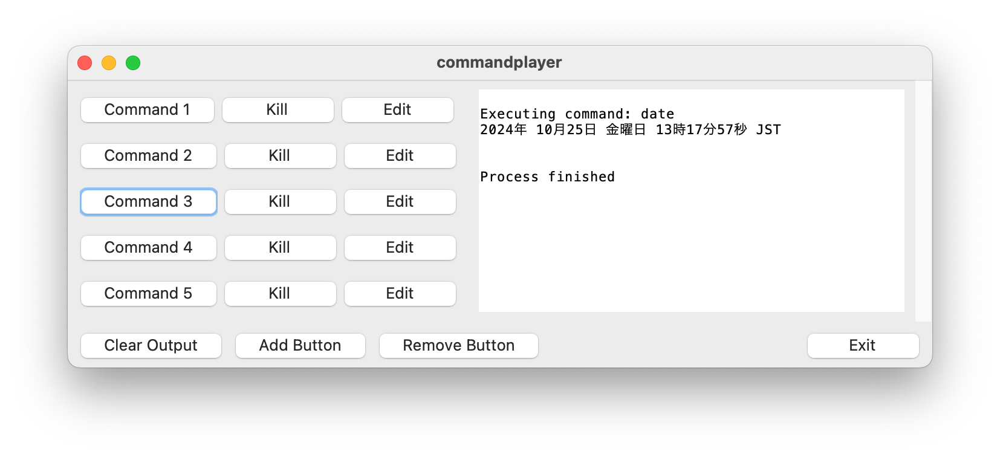

# commandplayer

commandplayer is a customizable GUI-based command execution tool.
Developed in Python, it provides a user-friendly interface using Tkinter.
This tool helps you efficiently manage and execute frequently used commands and scripts.


## Key Features

- Customizable command buttons
- Execution of both interactive and non-interactive commands
- Real-time command output display
- Dynamic button addition and removal
- Command editing functionality
- Kill functionality for running commands
- Save and load settings in JSON format
- Output clearing functionality


## Screenshot




## Requirements

- Python 3.6 or higher
- Tkinter (usually included with Python by default)


## Installation

```shell
$ cd commandplayer
$ python3 -m venv .
$ source ./bin/activate
$ pip3 install -r requrements.txt
$ python3 -m commandplayer
```


## Usage

1. Run the script:

```shell
$ python3 -m commandplayer
```

2. A GUI window will open. By default, 5 command buttons are displayed.

3. Click the "Edit" button next to each button to edit the button name and command.

4. Click a command button to execute the corresponding command, and the results will be displayed in real-time in the text area on the right.

5. To terminate a running command, click the corresponding "Kill" button.

6. Click "Add Button" to add a new command button.

7. Click "Remove Button" to remove the last command button.

8. Click the "Clear Output" button to clear the output text area.

9. Click the "Exit" button to terminate the application.


## Features

- Properly handles both interactive commands (such as ping) and non-interactive commands (such as ls).
- Can execute the same command consecutively.
- Properly tracks command execution state and performs termination processing as needed.
- Displays running commands in real-time.
- Application termination processing works correctly and properly terminates running processes.


## Customization

Command settings are saved in the `commands.json` file. You can manage commands from outside the application by directly editing this file.


## License

This project is released under the [MIT License](https://choosealicense.com/licenses/mit/).


## Contact

Tomoki Sato - [@tmksat](https://twitter.com/tmksat)

Project Link: [https://github.com/tmksat/commandplayer](https://github.com/tmksat/commandplayer)
