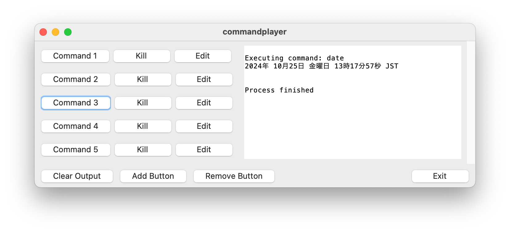

# commandplayer

commandplayerは、カスタマイズ可能なGUIベースのコマンド実行ツールです。
Pythonで開発されており、Tkinterを使用してユーザーフレンドリーなインターフェースを提供します。
このツールは、頻繁に使用するコマンドやスクリプトを効率的に管理し、実行するのに役立ちます。


## 主な機能

- カスタマイズ可能なコマンドボタン
- インタラクティブおよび非インタラクティブなコマンドの実行
- リアルタイムのコマンド出力表示
- 動的なボタンの追加・削除
- コマンドの編集機能
- 実行中のコマンドの終了（Kill）機能
- 設定のJSON形式での保存と読み込み
- 出力のクリア機能


## スクリーンショット




## 必要条件

- Python 3.6以上
- Tkinter（通常はPythonに標準で含まれています）


## インストール

```shell
$ cd commandplayer
$ python3 -m venv .
$ source ./bin/activate
$ pip3 install -r requrements.txt
$ python3 -m commandplayer
```


## 使用方法

1. スクリプトを実行します：

```shell
$ python3 -m commandplayer
```

2. GUIウィンドウが開きます。デフォルトで5つのコマンドボタンが表示されます。

3. 各ボタンの隣にある「Edit」ボタンをクリックして、ボタン名とコマンドを編集できます。

4. コマンドボタンをクリックすると、対応するコマンドが実行され、結果が右側のテキストエリアにリアルタイムで表示されます。

5. 実行中のコマンドを終了するには、対応する「Kill」ボタンをクリックします。

6. 「Add Button」をクリックして新しいコマンドボタンを追加できます。

7. 「Remove Button」をクリックして最後のコマンドボタンを削除できます。

8. 「Clear Output」ボタンをクリックして、出力テキストエリアをクリアできます。

9. 「Exit」ボタンをクリックしてアプリケーションを終了します。


## 特徴

- インタラクティブなコマンド（pingなど）と非インタラクティブなコマンド（lsなど）の両方を適切に処理します。
- 同じコマンドを連続して実行できます。
- コマンドの実行状態を適切に追跡し、必要に応じて終了処理を行います。
- 実行中のコマンドをリアルタイムで表示します。
- アプリケーションの終了処理が正しく機能し、実行中のプロセスを適切に終了させます。


## カスタマイズ

コマンドの設定は`commands.json`ファイルに保存されます。このファイルを直接編集することで、アプリケーション外からもコマンドを管理できます。


## ライセンス

このプロジェクトは[MITライセンス](https://choosealicense.com/licenses/mit/)の下で公開されています。


## 連絡先

Tomoki Sato - [@tmksat](https://twitter.com/tmksat)

プロジェクトリンク: [https://github.com/tmksat/commandplayer](https://github.com/tmksat/commandplayer)
